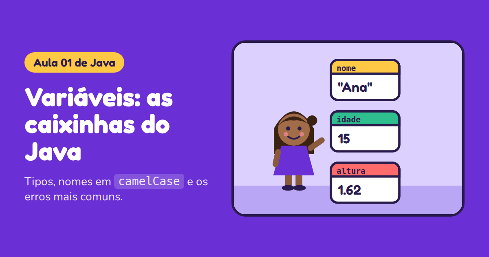

<div align="center">



# 💜 Aulas de Java 💜

### Programação para meninas que estão começando ✨


### 🌸 [Abrir as aulas](https://karolinecodes.github.io/AulasdeJava/) 🌸

</div>

---

## 🎀 Sobre o projeto

Este repositório reúne aulas de **Java** feitas para meninas que estão dando os primeiros passos na programação. Cada aula é uma página interativa: dá para clicar, testar, errar e tentar de novo, sem precisar instalar nada. É só abrir o link no celular ou no computador.

> 💡 **Programar é aprender a dar instruções ao computador.** E toda menina pode aprender isso.

---

## 📚 Aulas

| Nº | Aula | O que você aprende | Link |
|:--:|------|--------------------|:----:|
| 01 | 📦 **Variáveis** | Tipos de dados e o padrão camelCase | [Abrir 💜](https://karolinecodes.github.io/AulasdeJava/aulas/01-variaveis.html) |
| 02 | ➕ **Concatenação e operadores** | Contas, frases com variáveis e comentários | [Abrir 💜](https://karolinecodes.github.io/AulasdeJava/aulas/02-concatenacao-operadores.html) |
| 03 | 🌦️ **If e else** | Como o programa escolhe entre dois caminhos | [Abrir 💜](https://karolinecodes.github.io/AulasdeJava/aulas/03-if-else.html) |
| 04 | ✨ *em breve* | | |

---

## 🌷 Como usar

1. Abra o **[site das aulas](https://karolinecodes.github.io/AulasdeJava/)**
2. Escolha a aula do dia
3. Brinque com os exemplos, responda o quiz e tente o desafio 🏆

---

## 🗂️ Organização das pastas

```
AulasdeJava/
├── index.html          → página inicial com todas as aulas
├── README.md           → este arquivo
├── aulas/              → uma página por aula
│   ├── 01-variaveis.html
│   ├── 02-concatenacao-operadores.html
│   └── 03-if-else.html
└── imagens/            → capas que aparecem ao compartilhar o link
    ├── capa-01-variaveis.png
    ├── capa-02-concatenacao-operadores.png
    └── capa-03-if-else.png
```

---

## 👩‍💻 Mulheres que inspiram

<div align="center">

| 🌟 | Quem | O que fez |
|:--:|------|-----------|
| 💜 | **Ada Lovelace** | Escreveu o primeiro algoritmo para uma máquina |
| 🐛 | **Grace Hopper** | Criou um dos primeiros compiladores |
| 🚀 | **Margaret Hamilton** | Liderou o software da Apollo 11 |
| 🌙 | **Katherine Johnson** | Calculou trajetórias espaciais para a NASA |

</div>

---

<div align="center">

### 💖 Feito com carinho por [KarolineCodes](https://github.com/KarolineCodes) 💖

*Se você gostou, deixe uma ⭐ no repositório!*

</div>
