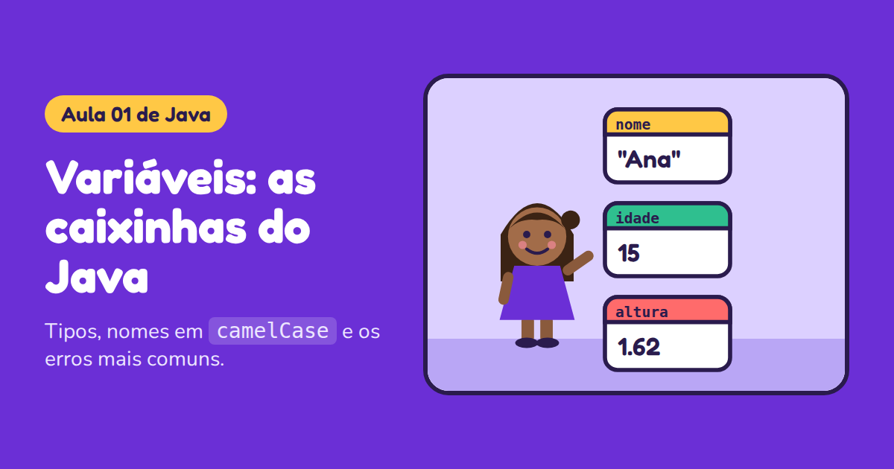

<div align="center">



# 💜 Aulas de Java 💜

### Programação para meninas que estão começando ✨


### 🌸 [Abrir as aulas](https://karolinecodes.github.io/AulasdeJava/) 🌸

</div>

---

## 🎀 Sobre o projeto

Este repositório reúne aulas de **Java** feitas para meninas que estão dando os primeiros passos na programação. Cada aula é uma página interativa: dá para clicar, testar, errar e tentar de novo, sem precisar instalar nada. É só abrir o link no celular ou no computador.

> 💡 **Programar é aprender a dar instruções ao computador.** E toda menina pode aprender isso.

---

## 📚 Aulas

| Nº | Aula | O que você aprende | Link |
|:--:|------|--------------------|:----:|
| 01 | 📦 **Variáveis** | Tipos de dados e o padrão camelCase | [Abrir 💜](https://karolinecodes.github.io/AulasdeJava/aulas/01-variaveis.html) |
| 02 | ➕ **Concatenação e operadores** | Contas, frases com variáveis e comentários | [Abrir 💜](https://karolinecodes.github.io/AulasdeJava/aulas/02-concatenacao-operadores.html) |
| 03 | 🌦️ **Condicionais** | Operadores relacionais, `if`, `else if`, `else`, `switch`, `!`, `&&`, `\|\|` e `printf` | [Abrir 💜](https://karolinecodes.github.io/AulasdeJava/aulas/03-condicionais.html) |
| 04 | 🪢 **Estruturas de repetição** | `for`, `while`, `do-while`, acumuladores, `break`, `continue` e laços aninhados | [Abrir 💜](https://karolinecodes.github.io/AulasdeJava/aulas/04-repeticao.html) |
| 05 | ⌨️ **Scanner** | Ler o teclado com `nextLine`, `nextInt`, `nextDouble` e o bug do Enter | [Abrir 💜](https://karolinecodes.github.io/AulasdeJava/aulas/05-scanner.html) |
| 06 | 🍪 **Classes e objetos** | Classes, atributos, `new` e `printf` com objetos | [Abrir 💜](https://karolinecodes.github.io/AulasdeJava/aulas/06-classes-objetos.html) |
| 07 | 🔤 **Strings** | `length`, `charAt`, `substring`, `contains`, `replace` e `equals` | [Abrir 💜](https://karolinecodes.github.io/AulasdeJava/aulas/07-strings.html) |
| 08 | 🗃️ **Arrays** | Criar, acessar pelo índice e percorrer com `for` | [Abrir 💜](https://karolinecodes.github.io/AulasdeJava/aulas/08-arrays.html) |
| 09 | ⚙️ **Métodos** | Parâmetros, `return`, `void`, `static` e sobrecarga | [Abrir 💜](https://karolinecodes.github.io/AulasdeJava/aulas/09-metodos.html) |
| 10 | 🕸️ **Tratamento de exceções** | `try`, `catch`, `finally` e como ler o erro | [Abrir 💜](https://karolinecodes.github.io/AulasdeJava/aulas/10-excecoes.html) |
| 11 | 🛒 **ArrayList e HashMap** | Listas que crescem e mapas de chave e valor | [Abrir 💜](https://karolinecodes.github.io/AulasdeJava/aulas/11-arraylist-hashmap.html) |
| 12 | ✨ *em breve* | | |

---

## 🌷 Como usar

1. Abra o **[site das aulas](https://karolinecodes.github.io/AulasdeJava/)**
2. Escolha a aula do dia
3. Brinque com os exemplos, responda o quiz e tente o desafio 🏆

---

## 🗂️ Organização das pastas

```
AulasdeJava/
├── index.html          → página inicial com todas as aulas
├── README.md           → este arquivo
├── aulas/              → uma página por aula
│   ├── 01-variaveis.html
│   ├── 02-concatenacao-operadores.html
│   ├── 03-condicionais.html
│   ├── 04-repeticao.html
│   ├── 05-scanner.html
│   ├── 06-classes-objetos.html
│   ├── 07-strings.html
│   ├── 08-arrays.html
│   ├── 09-metodos.html
│   ├── 10-excecoes.html
│   └── 11-arraylist-hashmap.html
└── imagens/            → capas que aparecem ao compartilhar o link
    ├── capa-01-variaveis.png
    ├── capa-02-concatenacao-operadores.png
    ├── capa-03-condicionais.png
    ├── capa-04-repeticao.png
    ├── capa-05-scanner.png
    ├── capa-06-classes-objetos.png
    ├── capa-07-strings.png
    ├── capa-08-arrays.png
    ├── capa-09-metodos.png
    ├── capa-10-excecoes.png
    └── capa-11-arraylist-hashmap.png
```

---

## 👩‍💻 Mulheres que inspiram

<div align="center">

| 🌟 | Quem | O que fez |
|:--:|------|-----------|
| 💜 | **Ada Lovelace** | Escreveu o primeiro algoritmo para uma máquina |
| 🐛 | **Grace Hopper** | Criou um dos primeiros compiladores |
| 🚀 | **Margaret Hamilton** | Liderou o software da Apollo 11 |
| 🌙 | **Katherine Johnson** | Calculou trajetórias espaciais para a NASA |

</div>

---

<div align="center">

### 💖 Feito com carinho por [KarolineCodes](https://github.com/KarolineCodes) 💖

*Se você gostou, deixe uma ⭐ no repositório!*

</div>
